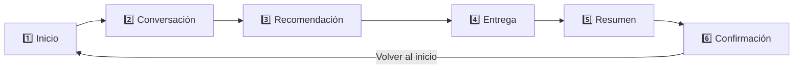

# OrderBot 🍔🤖

> ¡Pide fácil, recibe rápido!

Aplicación Android de ejemplo que simula un **asistente de pedidos de comida (chatbot)**
en un flujo de 6 pantallas, construida 100% con **Kotlin** y **Jetpack Compose**.


---

## 📱 Descripción

OrderBot guía al usuario desde la bienvenida hasta la confirmación de su pedido,
pasando por una conversación con el bot, una recomendación de complementos
(venta cruzada) y el resumen con el cálculo del total.



| Pantalla | Qué hace el usuario |
|---|---|
| **Inicio** | Ve la marca, el eslogan y los beneficios del servicio. |
| **Conversación** | El bot saluda y el usuario arma su carrito desde el catálogo. |
| **Recomendación** | El bot ofrece agregar papas 🍟 y bebida 🥤 al pedido. |
| **Entrega** | Escribe su dirección 📍 y elige el método de pago 💳. |
| **Resumen** | Revisa productos, subtotal, envío, total y datos de entrega. |
| **Confirmación** | Número de pedido real (id generado por Room), entrega estimada y estado. |

## 📸 Capturas de pantalla

| Inicio | Conversación | Recomendación | Resumen | Confirmación |
|:---:|:---:|:---:|:---:|:---:|
|  |  |  |  |  |
| Bienvenida en **modo oscuro** 🌙, con el logo, los beneficios y el botón *Comenzar*. | El bot saluda y muestra el catálogo: hamburguesa disponible y pizza "próximamente". | Venta cruzada: ofrece agregar papas y bebida antes de continuar. | Detalle del pedido con subtotal, envío y total calculados desde el `PedidoViewModel`. | Pedido creado con su número generado (#9916), que llega por la **ruta type-safe** de navegación. |

## ✨ Características

- 🎨 UI declarativa con **Jetpack Compose** y **Material 3**.
- 🌗 Tema claro y **oscuro** con paleta de marca propia (`OrderBotTheme`), botón para alternar ☀️/🌙/🌗 (automático) y **persistencia** de la elección con DataStore.
- 🧭 **Navigation Compose 2.9 type-safe**: rutas `@Serializable`, sin strings ni números mágicos.
- 🧠 **ViewModels con StateFlow** (patrón UDF): el estado del pedido y del tema sobrevive a rotaciones y se comparte entre pantallas.
- 🍔 **Catálogo completo con `LazyColumn`** y selector de cantidad [−] n [+] por producto.
- 📍 **Selección de dirección y método de pago** con validación antes de continuar.
- 🗄️ **Base de datos Room**: pedidos e ítems guardados en una transacción; el número de pedido es el id real generado por SQLite.
- 💾 Preferencia de tema persistida con **DataStore**.
- 💰 Precios centralizados en un catálogo: **una sola fuente de verdad**.
- 🧮 Lógica de negocio (subtotal/total) **separada de la UI** y con pruebas unitarias.
- 🌎 Textos en `strings.xml`, listos para traducir; precios formateados con `NumberFormat` (es-CO).
- 🖼️ Ícono de launcher adaptativo (incluye variante **monochrome** para íconos temáticos de Android 13+).
- 👁️ Previews de cada pantalla para iterar rápido en Android Studio.

## 🛠️ Tecnologías

| Área | Tecnología |
|---|---|
| Lenguaje | Kotlin 2.2.10 + kotlinx-serialization |
| UI | Jetpack Compose (BOM 2026.02.01) + Material 3 |
| Navegación | Navigation Compose 2.9 (rutas type-safe `@Serializable`) |
| Arquitectura | ViewModel + StateFlow (UDF) · Repository · DataStore Preferences |
| Persistencia | Room 2.7 (SQLite) con KSP |
| Build | Gradle 9.5 · AGP 9.3.2 · Kotlin DSL |
| Compatibilidad | minSdk 24 · targetSdk 37 |
| Pruebas | JUnit 4 + kotlinx-coroutines-test (17 pruebas unitarias) |

## 📂 Estructura del proyecto

```
app/src/main/java/com/example/myapplication/
├── MainActivity.kt              # Activity: tema (TemaViewModel) + AppNavigation
├── navigation/
│   ├── Rutas.kt                 # Rutas @Serializable (type-safe)
│   └── AppNavigation.kt         # NavHost con el grafo del flujo
├── viewmodel/
│   ├── PedidoViewModel.kt       # Estado del pedido compartido (StateFlow)
│   └── TemaViewModel.kt         # Modo de tema + persistencia
├── data/
│   ├── PreferenciasUsuario.kt   # Persistencia del modo de tema (DataStore)
│   ├── PedidoRepository.kt      # Puerta de acceso a Room
│   └── local/
│       ├── AppDatabase.kt       # @Database con patrón Singleton
│       ├── PedidoDao.kt         # @Dao: suspend + Flow + @Transaction
│       └── entities/            # PedidoEntity + ItemPedidoEntity (FK 1:N)
├── model/
│   ├── Producto.kt              # Producto + Catalogo (10 productos, precios únicos)
│   ├── ResumenPedido.kt         # ItemPedido (cantidad) + subtotal y total
│   ├── MetodoPago.kt            # Enum: EFECTIVO / TARJETA / BILLETERA_DIGITAL
│   └── ModoTema.kt              # Enum: SISTEMA / CLARO / OSCURO + ciclo
├── util/
│   └── FormatoPrecio.kt         # Int.aPrecio(): 29000 -> "$29.000" (es-CO)
└── ui/
    ├── components/              # Componentes reutilizables
    │   ├── Botones.kt           #   BotonPrimario / BotonSecundario
    │   ├── BotonModoTema.kt     #   Selector claro/oscuro/automático
    │   ├── ControlCantidad.kt   #   Selector de cantidad [−] n [+]
    │   ├── OrderBotCard.kt      #   Tarjeta base con estilo unificado
    │   ├── TarjetaBeneficio.kt
    │   ├── TarjetaProducto.kt   #   Con API de "slots" para la acción
    │   └── FilaPrecio.kt
    ├── screens/                 # Un archivo por pantalla
    │   ├── PantallaInicio.kt
    │   ├── PantallaConversacion.kt   # Catálogo con LazyColumn
    │   ├── PantallaRecomendacion.kt
    │   ├── PantallaEntrega.kt        # Dirección + método de pago
    │   ├── PantallaResumen.kt
    │   └── PantallaConfirmacion.kt
    └── theme/                   # Paleta de marca, tema claro/oscuro, tipografía
```

**Decisiones de diseño relevantes**

- **Catálogo como fuente única de verdad:** cada precio se define una sola vez en
  `Catalogo`; la pantalla de resumen se genera con un `forEach`, así que agregar
  un producto nuevo no requiere tocar la UI.
- **API de slots en `TarjetaProducto`:** quien la usa decide qué va al final de la
  fila (un botón *Elegir*, nada para un producto "próximamente", etc.), evitando
  duplicar layouts.
- **Composición sobre configuración:** `BotonPrimario`, `BotonSecundario` y
  `OrderBotCard` centralizan el estilo visual repetido en las 5 pantallas.

## 🚀 Cómo ejecutar

**Requisitos**

- [Android Studio](https://developer.android.com/studio) (versión reciente)
- JDK 17+ (el que incluye Android Studio funciona)
- Un emulador o dispositivo con Android 7.0 (API 24) o superior

**Pasos**

1. Clona el repositorio:
   ```bash
   git clone https://github.com/Juan77linux/5pantallas.git
   ```
2. Abre la carpeta del proyecto en Android Studio y espera el *sync* de Gradle.
3. Presiona **Run ▶** (`Shift + F10`) eligiendo un emulador o dispositivo.

**Desde la línea de comandos**

```bash
# Compilar el APK de depuración (queda en app/build/outputs/apk/debug/)
./gradlew :app:assembleDebug

# Ejecutar las pruebas unitarias
./gradlew :app:testDebugUnitTest
```

## 📄 Licencia

Este proyecto es un ejercicio educativo. Puedes usarlo libremente como referencia.

---

<p align="center">Hecho con 💙 y Kotlin</p>
